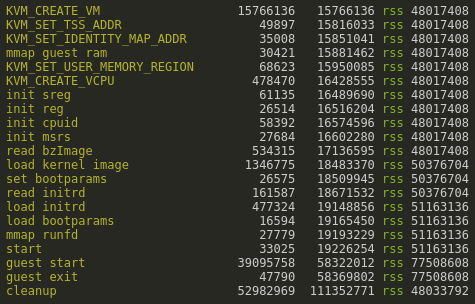
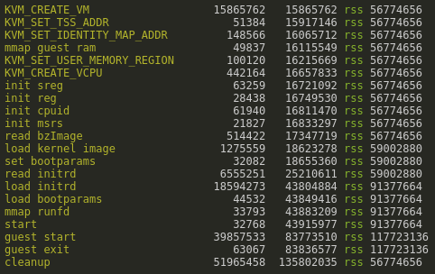

# joos

A KVM Virtual Machine Manager in JavaScript

## introduction

this is an attempt to build a functioning and useful virtual machine manager (vmm)
completely in JavaScript, on the "lo" JavaScript [runtime](https://github.com/just-js/lo).

## building

### from scratch


### with docker


## example run

```shell
lo vmm.js
```

- **CPU**: Intel(R) Core(TM) i5-8250U CPU @ 1.60GHz
- **OS**: 22.04.1-Ubuntu
- **Kernel**: 6.5.0-35-generic



This shows timing at steady state from running the compiled version of vmm.js against an initrd using the init.c c program.



This shows timing at steady state from running the compiled version of vmm.js against an initrd using the init.js JavaScript program compiled to a static binary.

Some things to note:

- takes ```~1.6 ms``` to create the VM using the ```KVM_CREATEVM``` ioctl
- takes ```~0.5 ms``` to create a VCPU
- ```bzImage``` is ```2.3 MB``` using LZ4 compression and takes ```~0.5 ms``` to read from ```/dev/shm```
- it takes ```~1.4 ms``` to set boot options and copy the ```bzImage``` into guest memory
- ```initrd``` is ```~820 KB``` and it takes ```~0.6 ms``` to read it from ```/dev/shm``` and load it into guest memory
- when we build the JavaScript init program the ```initrd``` is ```~32 MB```. this takes ```~6.6 ms``` to read from ```/dev/shm``` and ```~18 ms``` to copy into guest memory. so, roughly ```0.7 ms``` per megabyte of initrd.
- it takes ```~39 ms``` from booting the guest kernel to receiving the mmio event from the guest init program
  - this is with ```lz4``` kernel compression. with ```gzip``` this takes ```~60 ms``` and with lzma ```~200 ms```
- cleaning up the guest memory, unmapping mapped memory files and closing file descriptors takes ```~52 ms```
- there are no memory leaks. if we run continually we can see memory does not increase apart from some ```3-4 MB``` of v8 garbage that accumulates every 5 seconds or so before being freed by GC

just running one vm and then shutting down, and with debug logging turned off, the best time to run a vm seen under hyperfine is ```~110 ms```

```shell
$ hyperfine --warmup 10 ./vmm

Benchmark 1: ./vmm
  Time (mean ± σ):     134.0 ms ±  11.6 ms    [User: 34.1 ms, System: 22.7 ms]
  Range (min … max):   111.2 ms … 158.5 ms    22 runs
```

## todo

- handle terminal io correctly
- figure out why it hangs when we enable the IRQ chip
- add pvh boot support for loading vmlinux 
- run the cpu on it's own thread
- optimize everywhere we can
- lots more...
